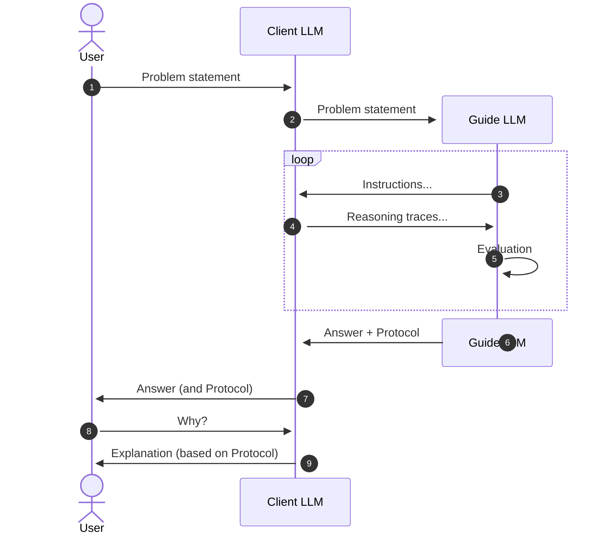

<div align="center">

</img>

# Logikon

*AI Analytics for Natural Language Reasoning.*

[Guided Reasoning™️ Demo](https://huggingface.co/spaces/logikon/benjamin-chat) | Technical Report (coming soon)

</div>

> [!NOTE]
> 🎉&nbsp; We're excited to announce the release of `Logikon 0.2.0` –– a major update to our analytics toolbox for natural-language reasoning. 

Main changes: 

* All LLM-based argument analysis pipelines are now built with _LCEL/LangChain_ (and not with LMQL anymore).
* We're introducing _Guided Reasoning™️_ (abstract interface and simple implementations) for walking arbitrary conversational AI agents through complex reasoning processes.
* AGPL license.

Our *short-term priorities* are housekeeping, code cleaning, and documentation. Don't hesitate to reach out if you have any questions or feedback, or if you'd like to contribute to the project.


## Installation 

```
pip install git+https://github.com/logikon-ai/logikon@v0.2.0
```

## Basic usage

```python
import os
from logikon import ascore, ScoreConfig

# 🔧 config 
config = ScoreConfig(
    global_kwargs={
        "expert_model": "meta-llama/Meta-Llama-3-70B-Instruct",
        "inference_server_url": "https://api-inference.huggingface.co/models/meta-llama/Meta-Llama-3-70B-Instruct",
        "llm_backend": "HFChat",
        "api_key": os.environ["HF_TOKEN"],
        "classifier_kwargs": {
            "model_id": "MoritzLaurer/DeBERTa-v3-base-mnli-fever-anli",
            "inference_server_url": "https://api-inference.huggingface.co/models/MoritzLaurer/DeBERTa-v3-base-mnli-fever-anli",
            "api_key": os.environ["HF_TOKEN"],
            "batch_size": 8,
        },
    }
)

# 📝 input to evaluate
issue = "Should I eat animals?",
reasoning = "No! Animals can suffer. Animal farming causes climate heating. Meat is not healthy.",

# 🏃‍♀️ run argument analysis
result = await ascore(
    prompt = issue,
    completion = reasoning,
    config = config,
)
```

## Guided Reasoning™️



<!--
## Quickstart

Start server.

```sh
bash scripts/run_vllm_server.sh
```

Run python client.

```python
from logikon import ascore

await ascore(
    prompt="What are the main reasons for spending a week-end in New York?",
    completion="""
    The main reasons for spending a week-end in New York are:
    1. You can do great shopping.
    2. You can eat wonderful food.
    3. You can meet many interesting people and friends.
    """
)
```

## Development

```sh
# style check
hatch run lint:style

# format code
hatch run lint:fmt

# check types (mypy)
hatch run lint:typing

# run tests
hatch run test
```

-->


