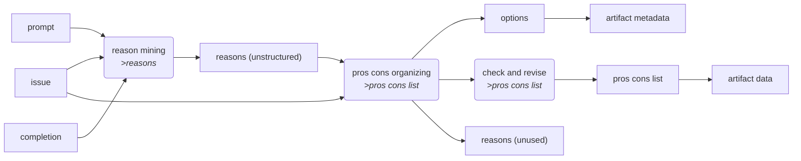

<!-- markdownlint-disable -->

<a href="https://github.com/logikon-ai/logikon/blob/main/src/logikon/debuggers/reconstruction/pros_cons_builder_lmql.py#L0"></a>

# <kbd>module</kbd> `logikon.debuggers.reconstruction.pros_cons_builder_lmql`
Module with debugger for building a pros & cons list with LMQL 



**Global Variables**
---------------
- **MAX_N_REASONS**
- **MAX_N_ROOTS**
- **MAX_LEN_TITLE**
- **MAX_LEN_GIST**
- **N_DRAFTS**
- **LABELS**
- **EXAMPLES_ISSUE_PROSCONS**

---

<a href="https://github.com/logikon-ai/logikon/blob/main/src/logikon/debuggers/reconstruction/pros_cons_builder_lmql.py#L122"></a>

## <kbd>function</kbd> `format_reason`

```python
format_reason(reason: 'Claim', max_len: 'int' = -1) → str
```


---

<a href="https://github.com/logikon-ai/logikon/blob/main/src/logikon/debuggers/reconstruction/pros_cons_builder_lmql.py#L129"></a>

## <kbd>function</kbd> `format_proscons`

```python
format_proscons(issue: 'str', proscons: 'ProsConsList') → str
```


---

<a href="https://github.com/logikon-ai/logikon/blob/main/src/logikon/debuggers/reconstruction/pros_cons_builder_lmql.py#L156"></a>

## <kbd>function</kbd> `format_examples`

```python
format_examples() → str
```


---

<a href="https://github.com/logikon-ai/logikon/blob/main/.virtualenvs/logikon/lib/python3.11/site-packages/lmql/api/queries.py#L166"></a>

## <kbd>function</kbd> `mine_reasons`

```python
mine_reasons(prompt, completion, issue) → List[Claim]
```

lmql  sample(temperature=.4)  """  {lmql_queries.system_prompt()} 

 ### User 

 Your Assignment: Summarize all the arguments (pros and cons) presented in a text. 

 Use the following inputs (a TEXT that addresses an ISSUE) to solve your assignment. 

 <TEXT>  {prompt}{completion}  </TEXT> 

 <ISSUE>  {issue}  </ISSUE> 

 What are the TEXT's arguments (pros and cons) that address the ISSUE? 

 Let me give you more detailed instructions: 


        - Go through the text from beginning to end and extract all arguments in the order of appearance. 
        - For each argument, sketch the argument's gist in one or two grammatically correct sentences, staying close to the original wording, and provide a telling title (2-4 words). I.e.: ```

                        - title: "a very short title"
               gist: "the argument's gist in 1-2 sentences."
            ``` 
        - Avoid repeating one and the same argument in different words. 
        - You don't have to distinguish between pro and con arguments. 
        - IMPORTANT: Stay faithful to the text! Don't invent your own reasons. Only provide reasons which are either presented or discussed in the text. 
        - Use yaml syntax and "```" code fences to structure your answer. 

 ### Assistant 

 The TEXT sets forth the following arguments: 

```yaml
         arguments:"""
         reasons = []
         marker = ""
         n = 0
         while n<MAX_N_REASONS:
             n += 1
             "[MARKER]" where MARKER in set(["
```", " 
- "])  marker = MARKER  if marker == " ```":
                 break
             else:
                 "title: "[TITLE]" where STOPS_AT(TITLE, """) and STOPS_AT(TITLE, "
") and len(TITLE) < MAX_LEN_TITLE
                 if not TITLE.endswith('"'):
                     "" "
                 title = TITLE.strip('"')
                 "
   gist: "[GIST]" where STOPS_AT(GIST, """) and STOPS_AT(GIST, "
") and len(GIST) < MAX_LEN_GIST
                 if not GIST.endswith('"'):
                     "" "
                 gist = GIST.strip('"')
                 reasons.append(Claim(label=title, text=gist))
         return reasons
     


---

<a href="https://github.com/logikon-ai/logikon/blob/main/.virtualenvs/logikon/lib/python3.11/site-packages/lmql/api/queries.py#L281"></a>

## <kbd>function</kbd> `build_pros_and_cons`

```python
build_pros_and_cons(reasons_data: 'list', issue: 'str')
```

lmql  sample(temperature=.4)  reasons = [Claim(**reason_data) for reason_data in reasons_data]  """  {lmql_queries.system_prompt()} 

 ### User 

 Assignment: Organize an unstructured set of reasons as a pros & cons list. 

 Let's begin by thinking through the basic issue addressed by the reasons: 

 <issue>{issue}</issue> 

 What are the basic options available to an agent who needs to address this issue? Keep your answer short: sketch each option in a few words only, one per line. Use "<options>"/"</options>" tags. 

 ### Assistant 

 The options available to an agent who faces the above issue are: 

 <options>  """  options = []  marker = ""  while len(options)<MAX_N_ROOTS:  "[MARKER]" where MARKER in set(["</options>", "- "])  marker = MARKER  if marker == "</options>":  break  else:  "[OPTION]" where STOPS_AT(OPTION, " ") and len(OPTION) < 32  options.append(OPTION.strip(" "))  """ 

 ### User 

 Thanks, let's keep that in mind. 

 Let us now come back to the main assignment: constructing a pros & cons list from a set of reasons. 

 You'll be given a set of reasons, which you're supposed to organize as a pros and cons list. To do so, you have to find a fitting target claim (root statement) the reasons are arguing for (pros) or against (cons). 

 Use the following inputs (a list of reasons that address an issue) to solve your assignment. 

 <inputs>  <issue>{issue}</issue>  <reasons>  """  for reason in reasons:  f_reason = format_reason(reason, 50)  "{f_reason}"  """</reasons>  </inputs> 

 Let me show you a few examples to illustrate the task / intended output: 

 {format_examples()} 

 Please consider carefully the following further, more specific instructions: 

 * Be bold: Your root claim(s) should be simple and unequivocal, and correspond to the basic options you have identified above.  * No reasoning: Your root claim(s) must not contain any reasoning (or comments, or explanations).  * Keep it short: Try to identify a single root claim. Add further root claims only if necessary (e.g., if reasons address three alternative decision options).  * Recall options: Use the options you've identified above to construct the pros and cons list.  * Be exhaustive: All reasons must figure in your pros and cons list.  * !!Re-organize!!: Don't stick to the order of the original reason list. 

 Moreover: 

 * Use simple and plain language.  * If you identify multiple root claims, make sure they are mutually exclusive alternatives.  * Avoid repeating one and the same root claim in different words.  * Use yaml syntax and "```" code fences to structure your answer. 

 ### Assistant 

 Let me recall the basic options before producing the pros and cons list:  """  for option in options:  "- {option} "  """ 

```yaml
         reasons:
         """
         for reason in reasons:
             f_reason = format_reason(reason)
             "{f_reason}"
         "issue: "{issue}"
"
         "pros_and_cons:
"
         unused_reasons = copy.deepcopy(reasons)
         roots = []
         "[MARKER]" where MARKER in set(["```", "- "])
         marker = MARKER
         while len(roots)<MAX_N_ROOTS and unused_reasons:
             if marker == "```":
                 break
             elif marker == "- ":  # new root
                 "root: "([TITLE]:" where STOPS_AT(TITLE, ")") and len(TITLE)<32
                 "[CLAIM]" where STOPS_AT(CLAIM, "
") and len(CLAIM)<128
                 root = RootClaim(label=TITLE.strip(')'), text=CLAIM.strip('"'))
                 "  pros:
"
                 while unused_reasons:
                     "[MARKER]" where MARKER in set(["  cons:
", "  - "])
                     marker = MARKER
                     if marker == "  - ":  # new pro
                         ""[[[REASON_TITLE]]]"
" where REASON_TITLE in set([reason.label for reason in unused_reasons])
                         selected_reason = next(reason for reason in unused_reasons if reason.label == REASON_TITLE)
                         root.pros.append(selected_reason)
                         unused_reasons.remove(selected_reason)
                     else:
                         break
                 # cons
                 while unused_reasons:
                     "[MARKER]" where MARKER in set(["```", "- ", "  - "])
                     marker = MARKER
                     if marker == "  - ":  # new con
                         ""[[[REASON_TITLE]]]"
" where REASON_TITLE in set([reason.label for reason in unused_reasons])
                         selected_reason = next(reason for reason in unused_reasons if reason.label == REASON_TITLE)
                         root.cons.append(selected_reason)
                         unused_reasons.remove(selected_reason)
                     else:
                         break

                 roots.append(root)

         return ProsConsList(roots=roots, options=options), unused_reasons

     


---

<a href="https://github.com/logikon-ai/logikon/blob/main/.virtualenvs/logikon/lib/python3.11/site-packages/lmql/api/queries.py#L414"></a>

## <kbd>function</kbd> `add_unused_reasons`

```python
add_unused_reasons(
    reasons_data: 'list',
    issue: 'str',
    pros_and_cons_data: 'dict',
    unused_reasons_data: 'list'
)
```

lmql  sample(temperature=.4)  reasons = [Claim(**reason_data) for reason_data in reasons_data]  unused_reasons = [Claim(**reason_data) for reason_data in unused_reasons_data]  pros_and_cons = ProsConsList(**pros_and_cons_data)  formatted_pcl = format_proscons(issue, pros_and_cons)  """  {lmql_queries.system_prompt()} 

 ### User 

 Assignment: Organize the aforementioned unstructured set of reasons as a pros & cons list. 

 ### Assistant 

 {formatted_pcl} 

 ### User 

 Thanks! However, I've realized that the following reasons haven't been integrated in the pros & cons list, yet:  """  for reason in unused_reasons:  f_reason = format_reason(reason, 50)  "{f_reason}"  """  Can you please carefully check the above pros & cons list, correct any errors and add the missing reasons? 

 ### Assistant 

```yaml
         reasons:
         """
         for reason in reasons:
             f_reason = format_reason(reason)
             "{f_reason}"
         "issue: "{issue}"
"
         "pros_and_cons:
"
         unused_reasons = copy.deepcopy(reasons)
         roots = []
         "[MARKER]" where MARKER in set(["```", "- "])
         marker = MARKER
         while len(roots)<MAX_N_ROOTS and unused_reasons:
             if marker == "```":
                 break
             elif marker == "- ":  # new root
                 "root: "([TITLE]:" where STOPS_AT(TITLE, ")") and len(TITLE)<32
                 "[CLAIM]" where STOPS_AT(CLAIM, "
") and len(CLAIM)<128
                 root = RootClaim(label=TITLE.strip(')'), text=CLAIM.strip('"'))
                 "  pros:
"
                 while unused_reasons:
                     "[MARKER]" where MARKER in set(["  cons:
", "  - "])
                     marker = MARKER
                     if marker == "  - ":  # new pro
                         ""[[[REASON_TITLE]]]"
" where REASON_TITLE in set([reason.label for reason in unused_reasons])
                         selected_reason = next(reason for reason in unused_reasons if reason.label == REASON_TITLE)
                         root.pros.append(selected_reason)
                         unused_reasons.remove(selected_reason)
                     else:
                         break
                 # cons
                 while unused_reasons:
                     "[MARKER]" where MARKER in set(["```", "- ", "  - "])
                     marker = MARKER
                     if marker == "  - ":  # new con
                         ""[[[REASON_TITLE]]]"
" where REASON_TITLE in set([reason.label for reason in unused_reasons])
                         selected_reason = next(reason for reason in unused_reasons if reason.label == REASON_TITLE)
                         root.cons.append(selected_reason)
                         unused_reasons.remove(selected_reason)
                     else:
                         break

                 roots.append(root)

         return ProsConsList(roots=roots, options=pros_and_cons.options), unused_reasons

     


---

<a href="https://github.com/logikon-ai/logikon/blob/main/.virtualenvs/logikon/lib/python3.11/site-packages/lmql/api/queries.py#L494"></a>

## <kbd>function</kbd> `unpack_reason`

```python
unpack_reason(reason_data: 'dict', issue: 'str')
```

lmql  sample(temperature=.4, top_k=100, top_p=0.95)  reason = Claim(**reason_data)  """  {lmql_queries.system_prompt()} 

 ### User 

 Your Assignment: Unpack the individual claims contained in an argumentation. 

 Use the following inputs (the title and gist of an argumentation that addresses an issue) to solve your assignment. 

 <inputs>  <issue>{issue}</issue>  <argumentation>  <title>{reason.label}</title>  <gist>{reason.text}</gist>  </argumentation>  </inputs> 

 What are the individual claims and basic reasons contained in this argumentation? 

 Let me give you more detailed instructions: 


        - Read the gist carefully and extract all individual claims it sets forth. 
        - State each claim clearly in simple and plain language. 
        - The basic claims you extract must not contain any reasoning (as indicated, e.g., by "because", "since", "therefore" ...). 
        - For each argumentation, state all the claims it makes in one grammatically correct sentences, staying close to the original wording. Provide a distinct title, too. I.e.: ```
             argumentation:
               issue: "repeat argumentation issue"
               title: "repeat argumentation title"
               gist: "repeat argumentation gist"
               claims:

                            - title: "first claim title"
                 claim: "state first claim in one sentence."

                            - ...
            ``` 
        - The individual claims you extract may mutually support each other, or represent independent reasons for one and the same conclusion; yet such argumentative relations need not be recorded (at this point). 
        - If the argumentation gist contains a single claim, just include that very claim in your list. 
        - Avoid repeating one and the same claim in different words. 
        - IMPORTANT: Stay faithful to the gist! Don't invent your own claims. Don't uncover implicit assumptions. Only provide claims which are explicitly contained in the gist. 
        - Use yaml syntax and "```" code fences to structure your answer. 

 I'll give you a few examples that illustrate the task. 

 <example> ```yaml
         argumentation:
           issue: "Eating animals?"
           title: "Climate impact"
           gist: "Animal farming contributes to climate change because it is extremely energy intensive and causes the degradation of natural carbon sinks through land use change."
           claims:

                    - title: "Climate impact"
             claim: "Animal farming contributes to climate change."

                    - title: "High energy consumption"
             claim: "Animal farming is extremely energy intensive."

                    - title: "Land use change"
             claim: "Animal farming causes the degradation of natural carbon sinks through land use change."
        ```  </example> 

 <example> ```yaml
         argumentation:
           issue: "Should Bullfighting be Banned?"
           title: "Economic benefit"
           gist: "Bullfighting can benefit national economies with an underdeveloped industrial base."
           claims:

                    - title: "Economic benefit"
             claim: "Bullfighting can benefit national economies with an underdeveloped industrial base."
        ```  </example> 

 <example> ```yaml
         argumentation:
           issue: "Video games: good or bad?"
           title: "Toxic communities"
           gist: "Many video gaming communities are widely regarded as toxic since online games create opportunities for players to stalk and abuse each other."
           claims:

                    - title: "Toxic communities"
             claim: "Many video gaming communities are widely regarded as toxic."

                    - title: "Opportunities for abuse"
             claim: "Online games create opportunities for players to stalk and abuse each other."
        ```  </example> 

 <example> ```yaml
         argumentation:
           issue: "Pick best draft"
           title: "Readability"
           gist: "Draft 1 is easier to read and much more funny than the other drafts."
           claims:

                    - title: "Readability"
             claim: "Draft 1 is easier to read than the other drafts."

                    - title: "Engagement"
             claim: "Draft 1 is much more funny than the other drafts."
        ```  </example> 

 Please, process the above inputs and unpack the individual claims contained in the argumentation. 

 ### Assistant 

 The argumentation makes the following basic claims: 

```yaml
         argumentation:
           issue: "{issue}"
           title: "{reason.label}"
           gist: "{reason.text}"
           claims:"""
         claims = []
         marker = ""
         n = 0
         while n<10:
             n += 1
             "[MARKER]" where MARKER in set(["
```", " 
  - "])  marker = MARKER  if marker == " ```":
                 break
             else:
                 "title: "[TITLE]" where STOPS_AT(TITLE, """) and STOPS_AT(TITLE, "
") and len(TITLE) < MAX_LEN_TITLE
                 if not TITLE.endswith('"'):
                     "" "
                 title = TITLE.strip('"')
                 "
     claim: "[CLAIM]" where STOPS_AT(CLAIM, """) and STOPS_AT(CLAIM, "
") and len(CLAIM) < MAX_LEN_GIST
                 if not CLAIM.endswith('"'):
                     "" "
                 claim = CLAIM.strip('"')
                 claims.append(Claim(label=title, text=claim))
         return claims

     


---

<a href="https://github.com/logikon-ai/logikon/blob/main/src/logikon/debuggers/reconstruction/pros_cons_builder_lmql.py#L634"></a>

## <kbd>class</kbd> `ProsConsBuilderLMQL`
ProsConsBuilderLMQL 

This LMQLDebugger is responsible for reconstructing a pros and cons list for a given issue. 


 


---

#### <kbd>property</kbd> logger

A :class:`logging.Logger` that can be used within the :meth:`run()` method. 

---

#### <kbd>property</kbd> product_type


---

<a href="https://github.com/logikon-ai/logikon/blob/main/src/logikon/debuggers/reconstruction/pros_cons_builder_lmql.py#L690"></a>

### <kbd>method</kbd> `check_and_revise`

```python
check_and_revise(
    pros_and_cons: 'ProsConsList',
    reasons: 'List[Claim]',
    issue: 'str'
) → ProsConsList
```

Checks and revises a pros & cons list 


**Args:**
 
 - <b>`pros_and_cons`</b> (List[Dict]):  the pros and cons list to be checked and revised 
 - <b>`issue`</b> (str):  the overarching issue addressed by the pros and cons 


**Returns:**
 
 - <b>`List[Dict]`</b>:  the revised pros and cons list 

For each pro (con) reason *r* targeting root claim *c*: 


- Checks if *r* supports (attacks) another root claim *c'* more strongly 
- Two sanity checks 
- Revises map accordingly 

---

<a href="https://github.com/logikon-ai/logikon/blob/main/src/logikon/debuggers/reconstruction/pros_cons_builder_lmql.py#L660"></a>

### <kbd>method</kbd> `ensure_unique_labels`

```python
ensure_unique_labels(reasons: 'List[Claim]') → List[Claim]
```

Revises labels of reasons to ensure uniqueness 


**Args:**
 
 - <b>`reasons`</b> (List[Claim]):  list of reasons 


**Returns:**
 
 - <b>`List[Claim]`</b>:  list of reasons with unique labels 

---

<a href="https://github.com/logikon-ai/logikon/blob/main/src/logikon/debuggers/reconstruction/pros_cons_builder_lmql.py#L656"></a>

### <kbd>method</kbd> `get_description`

```python
get_description() → str
```


---

<a href="https://github.com/logikon-ai/logikon/blob/main/src/logikon/debuggers/reconstruction/pros_cons_builder_lmql.py#L648"></a>

### <kbd>method</kbd> `get_product`

```python
get_product() → str
```


---

<a href="https://github.com/logikon-ai/logikon/blob/main/src/logikon/debuggers/reconstruction/pros_cons_builder_lmql.py#L652"></a>

### <kbd>method</kbd> `get_requirements`

```python
get_requirements() → list[str]
```


---

<a href="https://github.com/logikon-ai/logikon/blob/main/src/logikon/debuggers/reconstruction/pros_cons_builder_lmql.py#L856"></a>

### <kbd>method</kbd> `unpack_reasons`

```python
unpack_reasons(pros_and_cons: 'ProsConsList', issue: 'str') → ProsConsList
```

Unpacks each individual reason in a pros and cons list 


**Args:**
 
 - <b>`pros_and_cons`</b> (ProsConsList):  pros and cons list with reason to be unpacked 
 - <b>`issue`</b> (str):  overarching issue addressed by pros and cons 


**Returns:**
 
 - <b>`ProsConsList`</b>:  pros and cons list with unpacked reasons 


---

_This file was automatically generated via [lazydocs](https://github.com/ml-tooling/lazydocs)._
